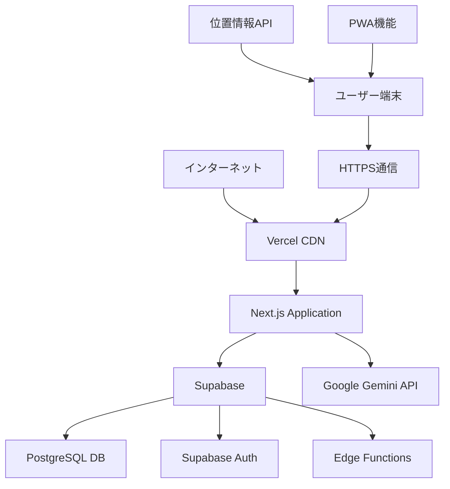
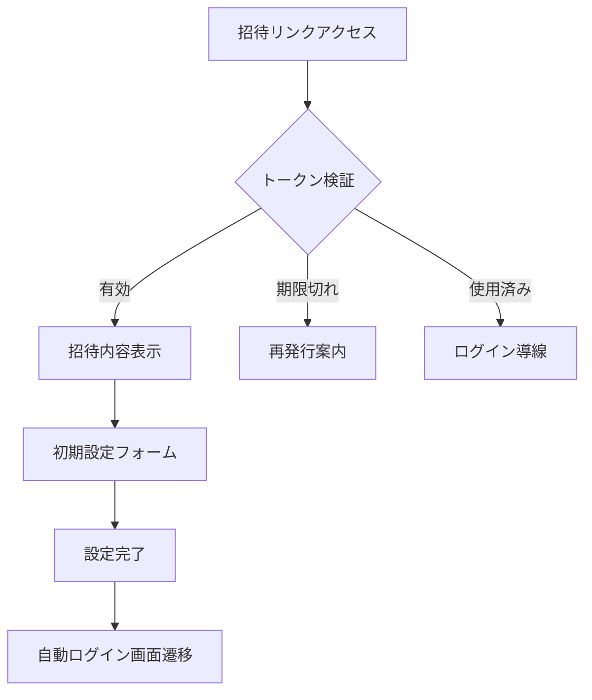
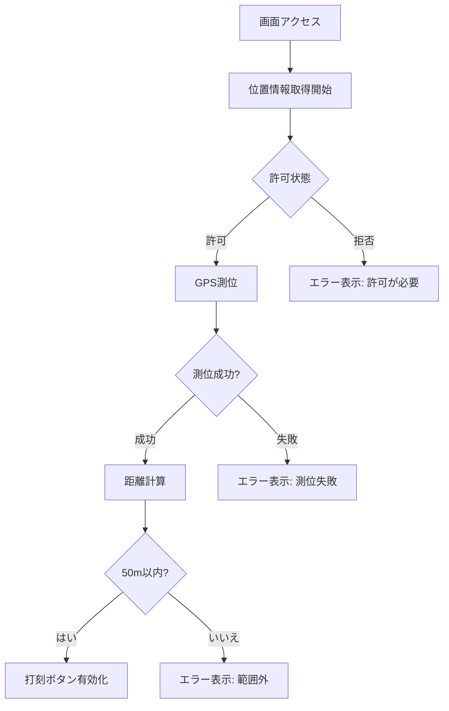
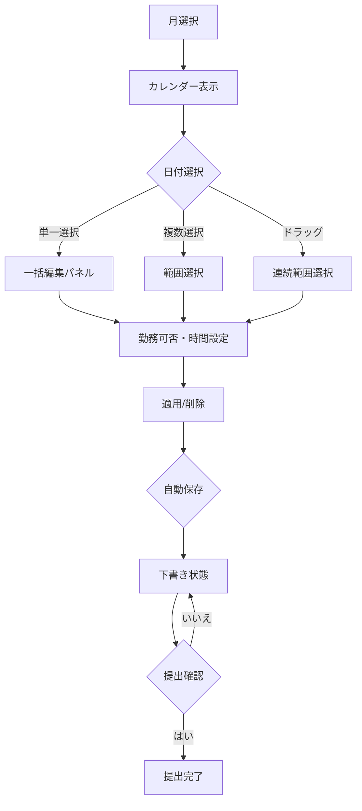
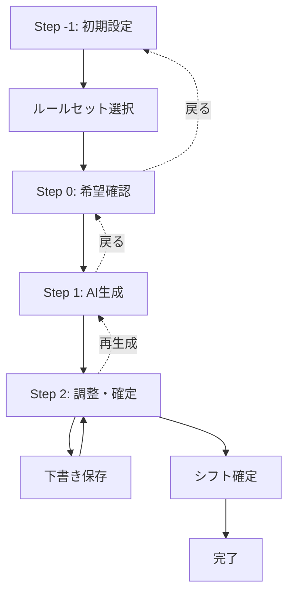
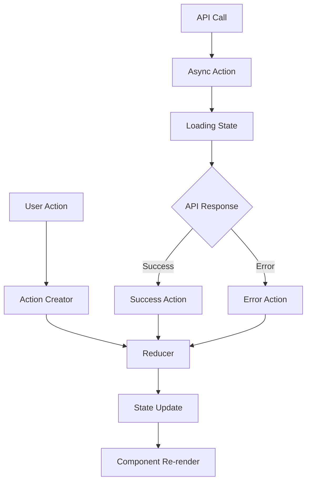
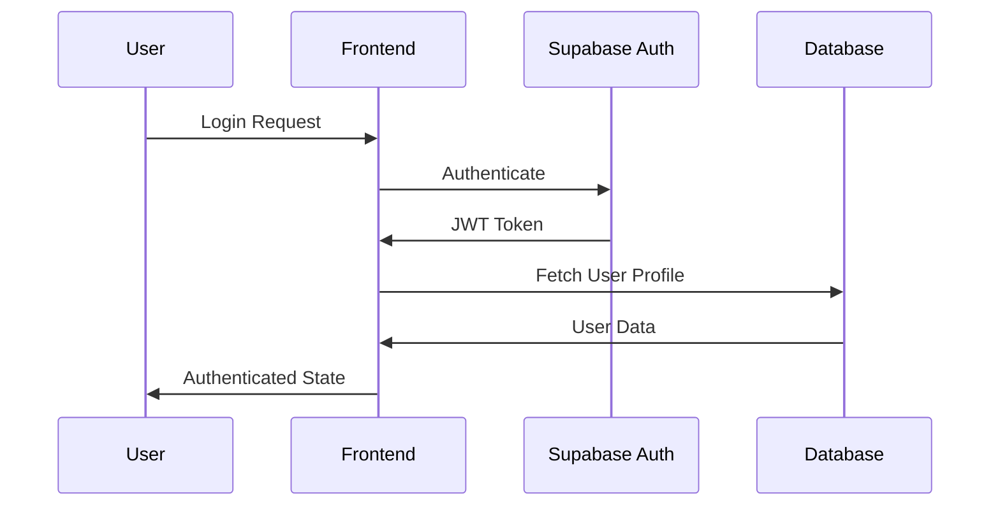
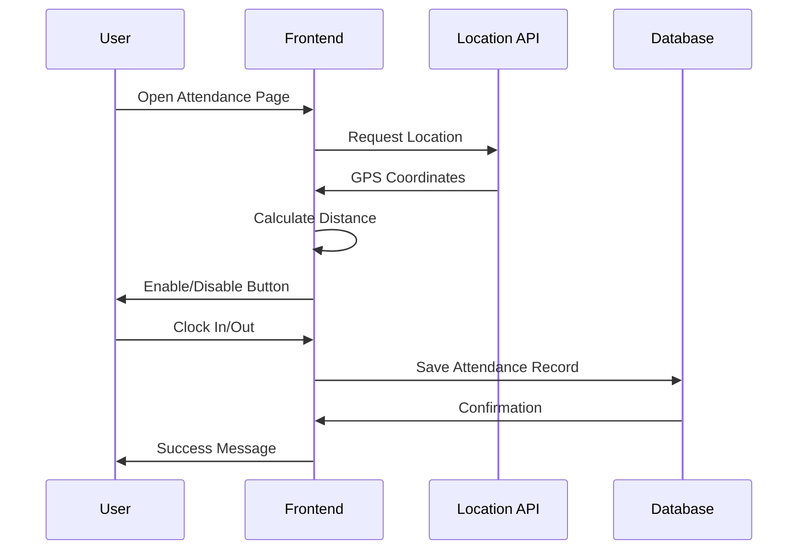

# 画面遷移・情報設計書 - シフト管理システム

**文書バージョン**: 1.0  
**作成日**: 2025年8月13日  
**プロジェクト名**: ShiftMaster

---

## 文書概要

本文書は、シフト管理システムの画面構成、画面間の遷移ルール、情報アーキテクチャ、レスポンシブデザイン方針を定義します。開発チームがUX一貫性を保ち、直感的なユーザーインターフェースを実装するための設計指針となります。

---

## 1. 全体システム構成

### 1.1 システム全体構成図



### 1.2 ユーザー権限・アクセス制御

| 権限レベル | ユーザー種別 | アクセス可能機能 |
|-----------|-------------|-----------------|
| **employee** | 従業員 | 出退勤、シフト希望提出・確認、プロフィール |
| **admin** | 店舗管理者 | 従業員機能 + 管理者ダッシュボード、シフト作成、従業員管理、勤怠管理、店舗設定 |
| **system_admin** | 運営管理者 | 管理者機能 + システム管理、マルチテナント、招待コード管理 |
| **public** | 未認証 | ログイン、パスワードリセット、オンボード、店舗登録 |

---

## 2. 画面一覧・ルーティング設計

### 2.1 フロントエンド画面構成

| No | 画面名 | ルート | 権限 | 主要機能 | レスポンシブ対応 |
|----|----|-------|------|---------|----------------|
| **認証・オンボーディング** |
| 001 | ログイン | `/login` | public | メール/パスワード認証 | ✓ |
| 002 | パスワードリセット | `/reset-password` | public | リセットメール送信・新パスワード設定 | ✓ |
| 003 | オンボード | `/onboard` | public | 招待リンク経由初期設定 | ✓ |
| **従業員向け画面** |
| 101 | 出退勤管理 | `/attendance` | employee | 位置情報連動打刻・履歴確認 | ✓ |
| 102 | シフト希望提出 | `/shift` | employee | 月次希望入力・提出 | ✓ |
| 103 | 確定シフト確認 | `/confirmed` | employee | 確定シフト閲覧・詳細確認 | ✓ |
| 104 | プロフィール | `/profile` | employee | 個人情報確認・変更 | ✓ |
| **管理者向け画面** |
| 201 | 管理者ダッシュボード | `/admin/home` | admin | 提出状況・クイックアクション | ✓ |
| 202 | シフト作成 | `/admin/shift-create` | admin | AI支援シフト作成・編集 | ✓ |
| 203 | シフトルール設定 | `/admin/shift-rules` | admin | ルールセット・パターン管理 | ✓ |
| 204 | 従業員管理 | `/admin/employees` | admin | 従業員情報・招待管理 | ✓ |
| 205 | 勤怠管理 | `/admin/attendance` | admin | 勤怠確認・修正 | ✓ |
| 206 | 店舗設定 | `/admin/settings` | admin | 営業時間・ルール・決済設定 | ✓ |
| **公開・システム管理** |
| 301 | 店舗登録 | `/register-store` | public | 新規店舗登録・決済 | ✓ |
| 302 | 決済結果 | `/billing/return` | public | Stripe決済完了・エラー画面 | ✓ |
| 401 | システム店舗一覧 | `/system/stores` | system_admin | 複数店舗管理 | - |
| 402 | システム店舗詳細 | `/system/stores/:id` | system_admin | 店舗詳細・操作 | - |
| 403 | 招待コード管理 | `/system/invite-codes` | system_admin | コード発行・管理 | - |

### 2.2 画面遷移フロー図

```mermaid
graph TD
    Start([システムアクセス]) --> Auth{認証状態}
    
    Auth -->|未ログイン| Login[/login<br/>ログイン画面]
    Auth -->|認証済み| Role{ユーザー権限}
    
    Login --> LoginSuccess{ログイン成功?}
    LoginSuccess -->|失敗| Login
    LoginSuccess -->|成功| Role
    
    Login -.->|パスワード忘れ| Reset[/reset-password]
    Login -.->|招待リンク| Onboard[/onboard]
    
    Role -->|employee| EmpHome[/attendance<br/>出退勤画面]
    Role -->|admin| AdminHome[/admin/home<br/>ダッシュボード]
    Role -->|system_admin| SysHome[/system/stores<br/>システム管理]
    
    %% 従業員画面遷移
    EmpHome --> EmpShift[/shift<br/>シフト希望]
    EmpHome --> EmpConfirmed[/confirmed<br/>確定シフト]
    EmpHome --> EmpProfile[/profile<br/>プロフィール]
    
    %% 管理者画面遷移
    AdminHome --> ShiftCreate[/admin/shift-create<br/>シフト作成]
    AdminHome --> Employees[/admin/employees<br/>従業員管理]
    AdminHome --> AttendanceManage[/admin/attendance<br/>勤怠管理]
    AdminHome --> Settings[/admin/settings<br/>店舗設定]
    
    ShiftCreate --> ShiftRules[/admin/shift-rules<br/>ルール設定]
    
    %% システム管理画面遷移
    SysHome --> SysStoreDetail[/system/stores/:id<br/>店舗詳細]
    SysHome --> InviteCodes[/system/invite-codes<br/>招待コード]
```

---

## 3. 画面別詳細設計

### 3.1 認証・オンボーディング画面

#### 3.1.1 ログイン画面 (`/login`)

**レイアウト構成**
```
┌─────────────────────────────────────┐
│              Header                 │
│    [Logo] ShiftMaster              │
├─────────────────────────────────────┤
│            Main Content             │
│                                     │
│         ┌─────────────────┐         │
│         │   Login Form    │         │
│         │  ┌───────────┐  │         │
│         │  │   Email   │  │         │
│         │  ├───────────┤  │         │
│         │  │ Password  │  │         │
│         │  ├───────────┤  │         │
│         │  │ [Login]   │  │         │
│         │  └───────────┘  │         │
│         │                 │         │
│         │  パスワード忘れ   │         │
│         └─────────────────┘         │
│                                     │
│        招待制のお知らせ              │
└─────────────────────────────────────┘
```

**状態遷移・バリデーション**
- 入力検証: メール形式、パスワード必須
- エラー表示: フィールド下部に赤文字
- 成功時遷移: 権限別ホーム画面
- 失敗時処理: エラーメッセージ表示、3回失敗でアカウントロック

**レスポンシブ対応**
- モバイル: 単一カラム、フルスクリーン
- タブレット/PC: 中央配置、最大幅600px

#### 3.1.2 オンボード画面 (`/onboard`)

**画面フロー**


**情報表示項目**
- 招待内容: 氏名、従業員コード、店舗名（権限・期限は非表示）
- 初期設定: メール（編集可）、パスワード（強度表示）
- 完了表示: 5秒後自動遷移、成功メッセージ

### 3.2 従業員向け画面

#### 3.2.1 出退勤管理画面 (`/attendance`)

**レイアウト構成**
```
┌─────────────────────────────────────┐
│     Navigation (mobile: hidden)    │
├─────────────────────────────────────┤
│              Header                 │
│  ┌─────────────────────────────────┐ │
│  │    大型時計（HH:MM:SS）          │ │
│  │    2025年8月13日（火）           │ │
│  └─────────────────────────────────┘ │
├─────────────────────────────────────┤
│            Current Status           │
│  ステータス: [勤務中] 出勤: 09:00    │
│  勤務時間: 3時間45分                 │
├─────────────────────────────────────┤
│          Location Status            │
│  📍 位置情報: OK (店舗まで35m)       │
├─────────────────────────────────────┤
│           Action Buttons            │
│  ┌──────────┐  ┌──────────┐        │
│  │   出勤   │  │   退勤   │        │
│  │ (緑色)   │  │ (赤色)   │        │
│  └──────────┘  └──────────┘        │
├─────────────────────────────────────┤
│           Today's History           │
│  09:00 出勤 📍                      │
│  12:00-13:00 休憩 (60分)           │
│  --:-- 退勤 (未完了)               │
└─────────────────────────────────────┘
```

**モード切替・簡易モード**
- loginモード: 個人ログイン、サイドバー表示
- simpleモード: 共用端末、従業員選択→打刻→自動リセット
- モード切替: ヘッダー右上のトグル（デモ時のみ表示）

**位置情報処理フロー**


#### 3.2.2 シフト希望提出画面 (`/shift`)

**レイアウト構成**
```
┌─────────────────────────────────────┐
│           Header & Navigation       │
│  ← 2025年2月 →  進捗: 65% 提出済み   │
├─────────────────────────────────────┤
│             Tab Menu                │
│  [カレンダー] [リスト]               │
├─────────────────────────────────────┤
│            Calendar View            │
│    日  月  火  水  木  金  土        │
│   ┌──┬──┬──┬──┬──┬──┬──┐      │
│   │  │  │  │  │ 1│ 2│ 3│      │
│   │  │  │  │  │ ○│NG│ ○│      │
│   ├──┼──┼──┼──┼──┼──┼──┤      │
│   │ 4│ 5│ 6│ 7│ 8│ 9│10│      │
│   │ ○│条件│○│NG│ ○│ ○│NG│      │
│   └──┴──┴──┴──┴──┴──┴──┘      │
├─────────────────────────────────────┤
│           Side Panel (PC)           │
│           Bottom Sheet (Mobile)     │
│  選択日: 2月5日-7日 (3日間)          │
│  ┌─────────────────────────────────┐ │
│  │ クイック設定                    │ │
│  │ [早番] [日勤] [遅番] [終日可]   │ │
│  ├─────────────────────────────────┤ │
│  │ 勤務可否: ○ OK  ○ NG          │ │
│  ├─────────────────────────────────┤ │
│  │ 希望時間: [09:00] - [17:00]   │ │
│  ├─────────────────────────────────┤ │
│  │ 備考: [________________]       │ │
│  ├─────────────────────────────────┤ │
│  │ [適用] [削除]                  │ │
│  └─────────────────────────────────┘ │
├─────────────────────────────────────┤
│          Bottom Actions             │
│  [下書き保存] saving... [提出]      │
└─────────────────────────────────────┘
```

**操作フロー**


**レスポンシブ対応**
- PC: サイドパネル編集、Shift+クリック/ドラッグ選択
- モバイル: ボトムシート編集、タップ/スワイプ選択
- モバイル固定ナビ: シフト提出/確定シフト/出退勤/提出ボタン

### 3.3 管理者向け画面

#### 3.3.1 管理者ダッシュボード (`/admin/home`)

**レイアウト構成**
```
┌─────────────────────────────────────┐
│           Sidebar Navigation        │
├─────────────────────────────────────┤
│              Header                 │
│  管理者ホーム - カフェSunny渋谷店     │
│  [対象月: 2025年2月 ▼] [シフト作成] │
├─────────────────────────────────────┤
│           Status Cards              │
│  ┌─────┐ ┌─────┐ ┌─────┐           │
│  │提出 │ │未提 │ │勤怠 │           │
│  │ 12  │ │ 3   │ │ 1   │           │
│  │件   │ │名   │ │件   │           │
│  └─────┘ └─────┘ └─────┘           │
├─────────────────────────────────────┤
│         Submission Status           │
│  シフト希望提出状況                  │
│  進捗: ████████░░ 80%               │
│  ┌─────────────────────────────────┐ │
│  │ ○ 佐藤太郎  提出済み 1/25 20:11 │ │
│  │ × 鈴木花子  未提出              │ │
│  │ ○ 田中一郎  提出済み 1/26 09:02 │ │
│  └─────────────────────────────────┘ │
├─────────────────────────────────────┤
│         Quick Actions               │
│  ┌─────────┐ ┌─────────┐ ┌─────────┐ │
│  │ シフト  │ │ 従業員  │ │ 勤怠   │ │
│  │ 管理    │ │ 管理    │ │ 管理   │ │
│  └─────────┘ └─────────┘ └─────────┘ │
├─────────────────────────────────────┤
│         Recent Activities           │
│  📅 2月の仮シフトを保存 (10分前)     │
│  👤 佐藤太郎が希望提出 (1時間前)     │
│  ⏰ 勤怠修正申請 (2時間前)          │
└─────────────────────────────────────┘
```

**データ更新・リアルタイム性**
- 提出状況: 5分間隔で自動更新
- 最近の更新: 1分間隔で追加
- 手動更新: プルダウンリフレッシュ対応

#### 3.3.2 シフト作成画面 (`/admin/shift-create`)

**ステップ構成**
```
Step -1: 初期設定
┌─────────────────────────────────────┐
│           Draft Panel               │
│  下書き: 2025年1月-通常期-ホール     │
│  保存: 1/28 14:30 [再開] [削除]     │
├─────────────────────────────────────┤
│         Position Selection          │
│  [全ポジション] [キッチン] [ホール]  │
│  [レジ]                            │
├─────────────────────────────────────┤
│         Rule Set Selection          │
│  ┌─────────┐ ┌─────────┐ ┌─────────┐ │
│  │ 通常期  │ │ 繁忙期  │ │ 閑散期  │ │
│  │ Blue   │ │ Orange │ │ Green  │ │
│  │ 標準配置│ │ 増員体制│ │ 少人数  │ │
│  │[選択]   │ │[選択]  │ │[選択]   │ │
│  └─────────┘ └─────────┘ └─────────┘ │
└─────────────────────────────────────┘
```

**Step 0-2 の画面遷移**


**Step 2: 調整画面レイアウト**
```
┌─────────────────────────────────────┐
│           View Toggle               │
│  [シフト表] [人員数] [CSV出力]       │
├─────────────────────────────────────┤
│            Shift Table              │
│    1日 2日 3日 ... 28日             │
│ 佐藤 ○  ○  ×  ... ○ (クリック編集) │
│ 鈴木 ×  ○  ○  ... × │
│ 田中 ○  ×  ○  ... ○ │
├─────────────────────────────────────┤
│          Edit Modal                 │
│  シフト編集 - 佐藤太郎               │
│  2025年2月5日 (月)                 │
│  ☐ 休み                           │
│  ポジション: [ホール ▼]             │
│  時間: [09:00] - [17:00]           │
│  [キャンセル] [保存]                │
└─────────────────────────────────────┘
```

#### 3.3.3 従業員管理画面 (`/admin/employees`)

**レイアウト構成**
```
┌─────────────────────────────────────┐
│              Header                 │
│  従業員管理 総数:15名 稼働中:12名    │
│  [CSV取込] [エクスポート] [新規登録] │
├─────────────────────────────────────┤
│           Filter Panel              │
│  検索: [_______________] 🔍         │
│  雇用形態: [すべて ▼] ステータス:[▼] │
├─────────────────────────────────────┤
│           Employee List             │
│  ☐ 従業員    雇用 ポジション 有給 保険 │
│  ☐ E001     正社 [H][K]    5日  ●▲- │
│     佐藤太郎  員              80%    │
│  ☐ E002     パト [K]       3日  ●●● │
│     鈴木花子  時              65%    │
│  ┌─────────────────────────────────┐ │
│  │         Edit Modal              │ │
│  │  基本情報｜雇用情報｜社会保険    │ │
│  │  従業員コード: [E003]           │ │
│  │  氏名: [田中一郎]              │ │
│  │  メール: [tanaka@example.com]  │ │
│  │  [招待リンク生成] [キャンセル]   │ │
│  │  [保存]                        │ │
│  └─────────────────────────────────┘ │
├─────────────────────────────────────┤
│            Footer                   │
│  15名中3名選択     [1/3] [< 前 次 >] │
└─────────────────────────────────────┘
```

**フィルタ・検索仕様**
- リアルタイム検索（文字入力時即座に反映）
- 複合フィルタ（雇用形態 × ステータス × キーワード）
- 検索対象：氏名、カナ、メール、従業員コード
- ページネーション：20件/ページ

### 3.4 エラー・例外画面設計

#### 3.4.1 エラー状態の表示パターン

**フィールドレベルエラー**
```
┌─────────────────────────────────────┐
│  メールアドレス *                    │
│  [tanaka@example.co_]              │
│  ❌ 正しいメールアドレスを入力してく │
│     ださい                         │
└─────────────────────────────────────┘
```

**ページレベルエラー**
```
┌─────────────────────────────────────┐
│              Error Page             │
│                                     │
│         ⚠️ エラーが発生しました        │
│                                     │
│  ネットワークに接続できませんでした    │
│  しばらく時間をおいて再度お試しくださ  │
│  い                                │
│                                     │
│         [再試行] [ホームに戻る]       │
└─────────────────────────────────────┘
```

**位置情報エラー**
```
┌─────────────────────────────────────┐
│  📍 位置情報が取得できません           │
│                                     │
│  以下をご確認ください：                │
│  • ブラウザの位置情報許可             │
│  • GPS機能の有効化                  │
│  • 屋外または窓際での操作             │
│                                     │
│  [設定を確認] [手動で承認依頼]        │
└─────────────────────────────────────┘
```

---

## 4. レスポンシブデザイン設計

### 4.1 ブレークポイント定義

| デバイス | 画面幅 | レイアウト | 主要変更点 |
|---------|--------|-----------|-----------|
| **Mobile** | ~767px | シングルカラム | サイドバー非表示、ボトムナビ、タッチ操作最適化 |
| **Tablet** | 768px~1023px | 2カラム | サイドバー折りたたみ、中間レイアウト |
| **Desktop** | 1024px~ | 2-3カラム | 全機能表示、マウス操作最適化 |

### 4.2 デバイス別UI調整

#### 4.2.1 ナビゲーション

**Desktop (1024px+)**
```
┌─ Sidebar ─┬─────── Main Content ──────┐
│   ┌──────┐│                           │
│   │ Logo ││                           │
│   ├──────┤│                           │
│   │ Menu ││                           │
│   │ Home ││                           │
│   │ Shift││                           │
│   │ ...  ││                           │
│   └──────┘│                           │
└───────────┴───────────────────────────┘
```

**Mobile (~767px)**
```
┌─────── Header ───────┐
│ ☰ Title      [User] │
├─────────────────────┤
│                     │
│   Main Content      │
│                     │
├─────────────────────┤
│ [🏠] [📅] [👥] [⚙️]  │
│ Bottom Navigation   │
└─────────────────────┘
```

#### 4.2.2 出退勤画面のレスポンシブ

**Desktop Layout**
```
┌─────────────────────────────────────┐
│    ┌──── Clock ────┐                │
│    │  09:45:23    │                │
│    │ 2025年8月13日 │                │
│    └──────────────┘                │
│                                     │
│  ┌────────────┐  ┌────────────┐      │
│  │    出勤    │  │    退勤    │      │
│  │  (大ボタン) │  │  (大ボタン) │      │
│  └────────────┘  └────────────┘      │
│                                     │
│     Today's History                 │
└─────────────────────────────────────┘
```

**Mobile Layout**
```
┌─────────────────────────────────────┐
│         ┌── Clock ──┐                │
│         │ 09:45:23 │                │
│         │2025年8月13│                │
│         └──────────┘                │
│                                     │
│         ┌──────────┐                │
│         │   出勤   │                │
│         └──────────┘                │
│         ┌──────────┐                │
│         │   退勤   │                │
│         └──────────┘                │
│                                     │
│       Today's History               │
└─────────────────────────────────────┘
```

### 4.3 タッチ操作最適化

**タッチターゲットサイズ**
- 最小サイズ: 44px × 44px (iOS HIG準拠)
- 推奨サイズ: 48dp × 48dp (Material Design準拠)
- ボタン間隔: 最低8px

**ジェスチャー対応**
- スワイプ: カレンダー月切り替え、範囲選択
- ピンチズーム: カレンダー詳細表示
- プルトゥリフレッシュ: データ更新
- 長押し: コンテキストメニュー表示

---

## 5. 状態管理・データフロー

### 5.1 フロントエンド状態管理

**状態分類**
```typescript
interface AppState {
  // 認証・ユーザー情報
  auth: {
    user: User | null;
    session: Session | null;
    loading: boolean;
  };
  
  // UI状態
  ui: {
    sidebarOpen: boolean;
    currentTheme: 'light' | 'dark';
    notifications: Notification[];
    modals: ModalState[];
  };
  
  // 業務データ
  attendance: {
    todayRecord: AttendanceRecord | null;
    history: AttendanceRecord[];
    locationStatus: LocationStatus;
  };
  
  shift: {
    currentMonth: string;
    requests: ShiftRequest[];
    confirmed: ConfirmedShift[];
    submissionStatus: SubmissionStatus;
  };
  
  admin: {
    dashboard: DashboardData;
    employees: Employee[];
    shiftCreation: ShiftCreationState;
  };
}
```

**状態更新パターン**


### 5.2 データフロー設計

**認証フロー**


**出退勤フロー**


---

## 6. アクセシビリティ・ユーザビリティ

### 6.1 アクセシビリティ対応

**WCAG 2.1 AA準拠**
- 色覚対応: 色だけに依存しない情報伝達
- キーボード操作: Tab順序、フォーカス表示
- スクリーンリーダー: 適切なaria-label、見出し構造
- コントラスト比: 4.5:1以上の確保

**実装例**
```html
<!-- フォーカス可能な要素 -->
<button 
  aria-label="2月5日のシフト希望を編集"
  tabindex="0"
  class="focus:ring-2 focus:ring-orange-500"
>
  5日
</button>

<!-- 状態を表す要素 -->
<div 
  role="status" 
  aria-live="polite"
  aria-label="シフト希望の保存中"
>
  <span class="sr-only">保存中...</span>
  <div class="spinner"></div>
</div>
```

### 6.2 ユーザビリティ設計

**認知負荷軽減**
- 一画面一機能の原則
- 進捗表示（ステップインジケーター）
- 明確なフィードバック（保存中/完了/エラー）
- 一貫したUI要素（ボタン、アイコン、色）

**操作効率化**
- キーボードショートカット
- 一括操作機能
- デフォルト値の設定
- オートコンプリート・候補表示

---

## 7. パフォーマンス最適化

### 7.1 読み込み最適化

**コード分割**
```typescript
// ルートベース分割
const AdminDashboard = lazy(() => import('./pages/admin/Dashboard'));
const ShiftCreate = lazy(() => import('./pages/admin/ShiftCreate'));

// 機能ベース分割
const CalendarComponent = lazy(() => import('./components/Calendar'));
```

**画像・リソース最適化**
- WebP形式での提供
- レスポンシブ画像（srcset）
- lazy loading
- CDN配信（Vercel）

### 7.2 レンダリング最適化

**React最適化**
```typescript
// メモ化
const ShiftCell = memo(({ date, employee, shift }) => {
  return <div>{/* render logic */}</div>;
});

// useMemo for expensive calculations
const filteredEmployees = useMemo(() => {
  return employees.filter(emp => 
    emp.name.includes(searchTerm)
  );
}, [employees, searchTerm]);

// useCallback for stable references
const handleSubmit = useCallback((data) => {
  submitShiftRequest(data);
}, []);
```

**バンドルサイズ最適化**
- tree shaking
- 不要な依存関係削除
- 動的import
- gzip/brotli圧縮

---

## 8. セキュリティ考慮事項

### 8.1 フロントエンドセキュリティ

**XSS対策**
```typescript
// サニタイゼーション
import DOMPurify from 'dompurify';

const sanitizedHtml = DOMPurify.sanitize(userInput);

// CSP (Content Security Policy)
const securityHeaders = {
  'Content-Security-Policy': 
    "default-src 'self'; script-src 'self' 'unsafe-inline'"
};
```

**認証・認可**
```typescript
// Route Protection
const ProtectedRoute = ({ children, requiredRole }) => {
  const { user, role } = useAuth();
  
  if (!user) return <Redirect to="/login" />;
  if (role !== requiredRole) return <Unauthorized />;
  
  return children;
};

// データアクセス制御
const useEmployeeData = () => {
  const { user } = useAuth();
  return useQuery(['employees'], 
    () => fetchEmployees(user.storeId),
    { enabled: !!user }
  );
};
```

### 8.2 データ保護

**機密情報の扱い**
- JWT tokenのSecure storage
- 位置情報の最小限取得
- パスワードの平文非表示
- ログアウト時のデータクリア

---

## 文書改訂履歴

| バージョン | 日付 | 変更内容 | 作成者 |
|-----------|------|---------|--------|
| 1.0 | 2025年8月13日 | 初版作成：画面設計・遷移・レスポンシブ対応 | システム設計者 |